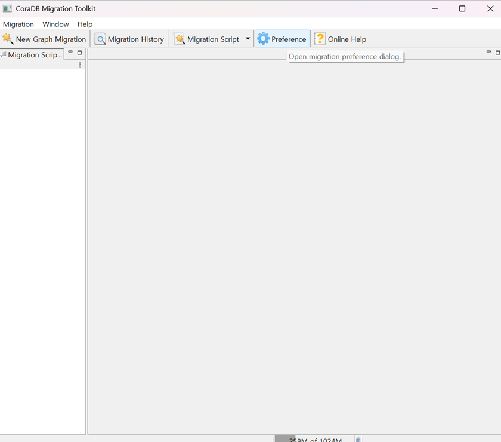
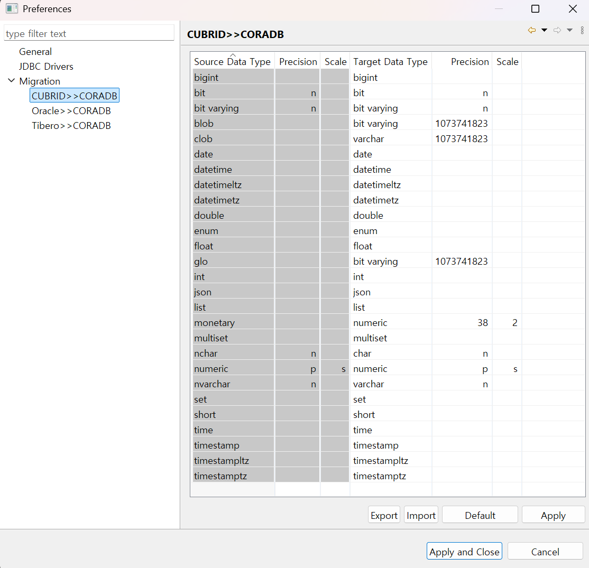

:meta-keywords: guide tool
:meta-description: change data type mapping

************************
Change Type Mapping
************************

This feature is used when you want to change the data type of values migrated to the target DB during migration.

The steps to access this menu are as follows.

1. Select the Settings menu.

2. Select the desired migration type from the Migration menu.

3. Select and edit the desired data type mapping.

