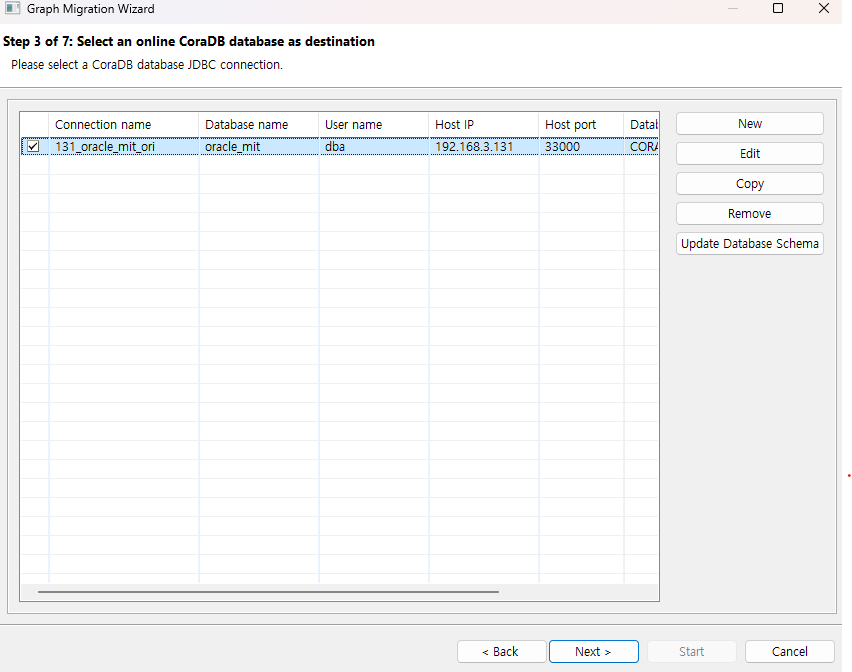
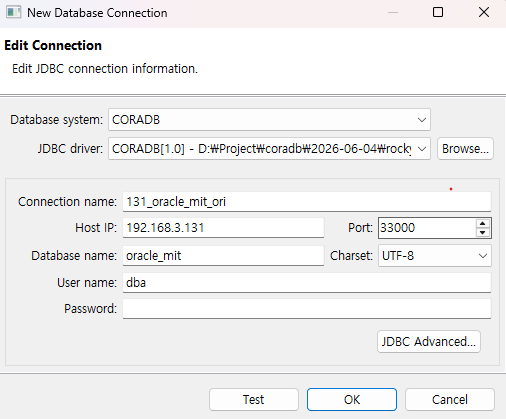
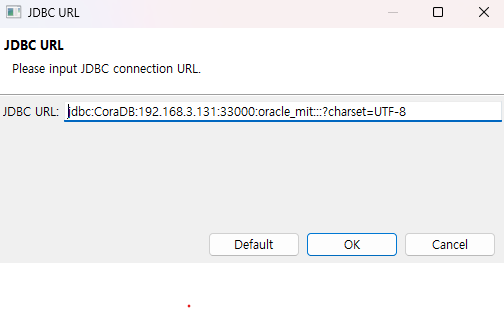

:meta-keywords: guide tool
:meta-description: Introducing the features of select tar page

****************************
Target DB Connection Selection Page
****************************

Manages the connection for the target DB.

You can select a pre-existing connection or create a new valid connection, then proceed to the object mapping page.

There are no significant differences from the source DB connection selection page.

=============
Create Connection
=============

Creates a connection.

------------------
Database Type
------------------

Indicates the type of the currently selected database.

---------------------
Select JDBC Driver
---------------------

Click Browse to add a JDBC driver. If you have done this before, you can reuse a previously used JDBC driver via the ComboBox menu.

------------------------
Connection Name
------------------------

Enter a name to be displayed on the target DB selection page.

------------------------
Host Address
------------------------

Enter the IP address where the target DB is located.

------------------------
Connection Port
------------------------

Enter the port number of the DB. The default value for CoraDB is set to 33000.

------------------------
Database Name
------------------------

Enter the schema or DB name within the target DB. (e.g., demodb for CoraDB's sample DB)

------------------------
Character Set
------------------------

Encoding types supported by CUBRID are as follows.

* UTF-8 (default)
* MS949
* ISO-8859-1
* EUC-KR
* EUC-JR
* GB2312
* GBK

-------------------------
Username
-------------------------

Enter the account name to connect to the DB.

-------------------------
Password
-------------------------

Enter the account password.

-------------------------
JDBC Advanced Settings
-------------------------

Allows customization of the JDBC URL. If a parameter is required when connecting to the DB, it can be configured here.

========================
Test
========================

Tests the connection using the entered information.

.. image:: ./image/select_conn_test.png
