:meta-keywords: guide tool
:meta-description: Introducing the features of object mapping page

*******************************
Schema Mapping Page
*******************************

=================
Schema Selection and Change
=================
This page allows you to select the schema from the source DB that you want to migrate.
A list of schemas with access permissions is displayed. Since CoraDB currently does not support multi-schema, migration is only possible to a single schema.
Click the Update Database Objects button to reload and display updated object information.

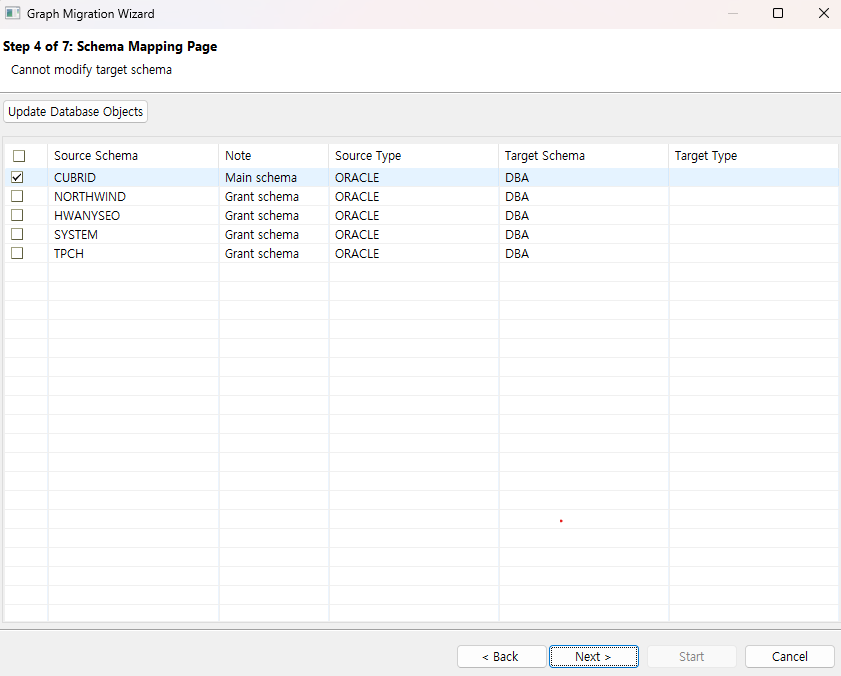

*******************************
Object Mapping Page
*******************************

====================
Table Selection
====================

This page allows you to select the tables from the source DB that you want to migrate.

The manual uses the northwind sampleDB.

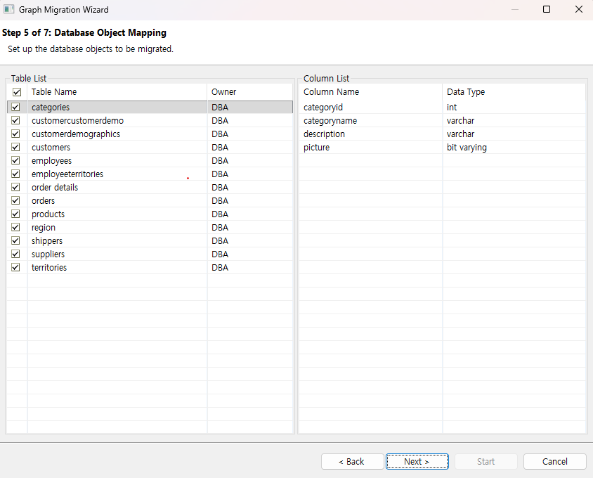

==============
Table List
==============

Displays the list of tables from the source DB. Click each row to specify whether to include it in the migration.
By default, all tables are set to be migrated.

==============
Column List
==============

When a table is selected from the table list, the column information for that table is displayed.
After selecting the tables to migrate, proceed to the next page.

=======
Graph
=======

Shows a preview of how the objects selected on the previous page will appear in GraphDB after migration.

==================
RDB, GDB Columns
==================

When an object is selected in the graph view, you can see the column information for that object in both RDB and GDB.

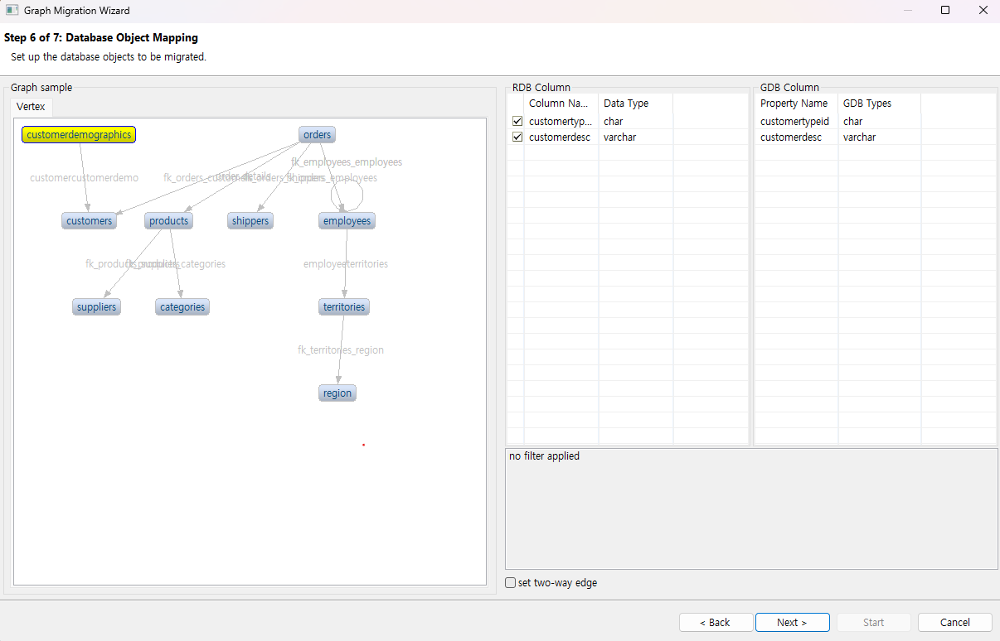

==================================
GDB Column Data Type Change
==================================

Certain data types for GDB columns can be changed.

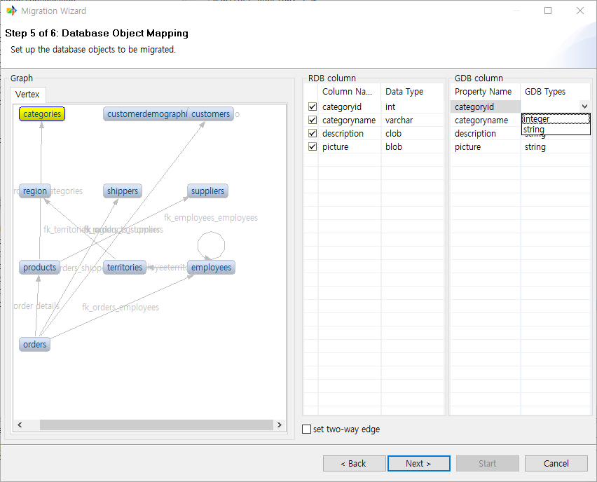

Only changing to the same type or to string type is supported.

========================
Object Rename Feature
========================

You can rename a vertex or edge.

The steps are as follows.

1. Right-click the object you want to rename and select Change Name.

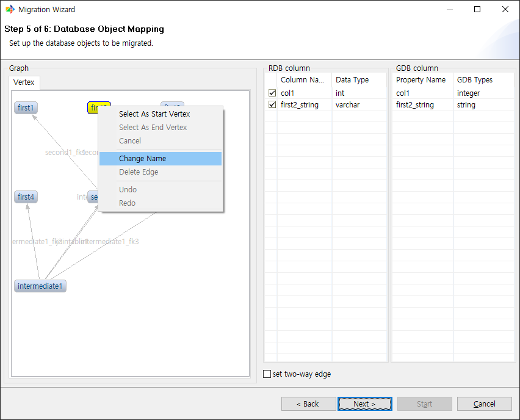

2. Enter the desired name and click OK.

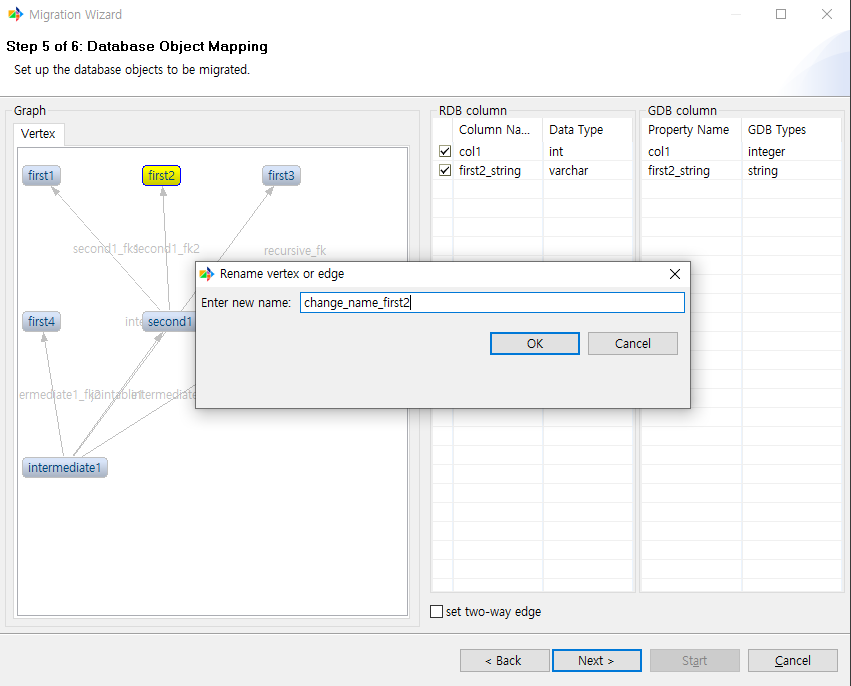

3. Confirm that the name has been changed.

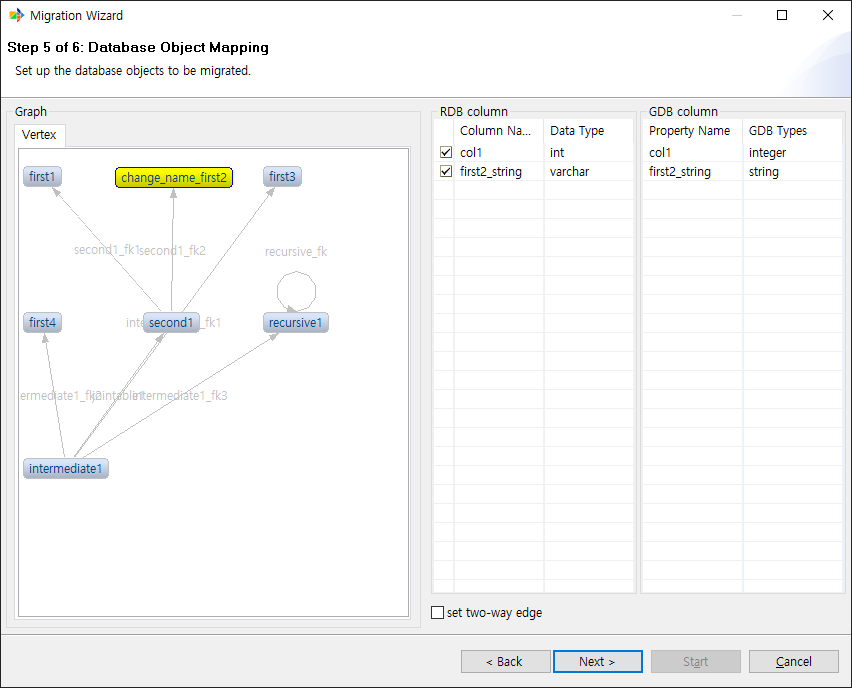

==============================
Custom Edge Add Feature
==============================

In the graph view, you can add an edge manually when certain conditions are met.

The steps are as follows.

1. First, right-click the vertex you want to set as the start vertex and select it.

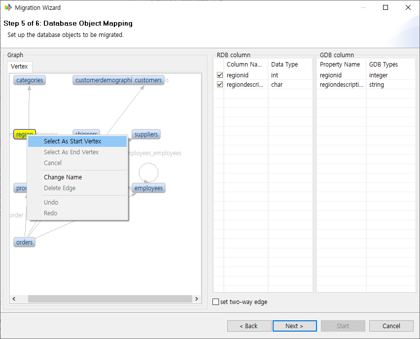

2. Similarly, right-click the vertex you want to set as the end vertex and select it. This option becomes active once the start vertex is selected.

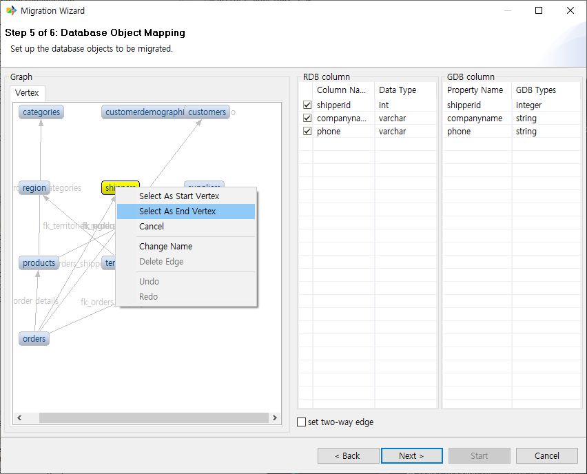

3. In the Create New Edge dialog, enter the edge name and select the column to link as FK from the table below. The data types of each column must match.

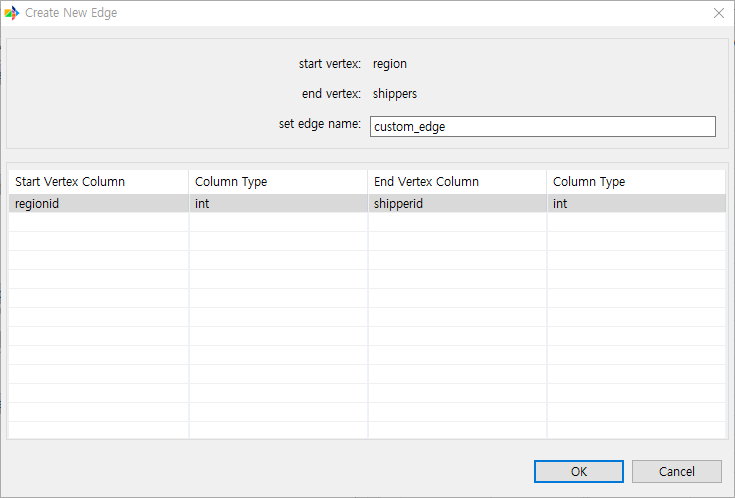

4. Click OK to confirm that the custom edge has been created.

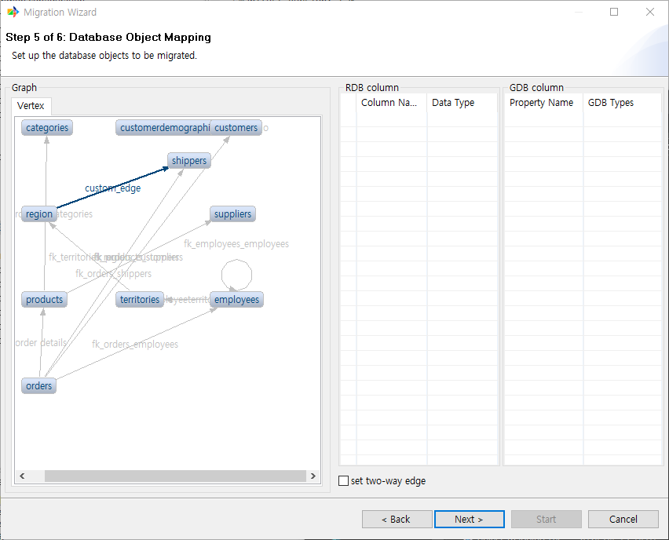

=======================================
Edge Delete Feature
=======================================

You can delete an edge.

1. Select the edge you want to delete and right-click it.

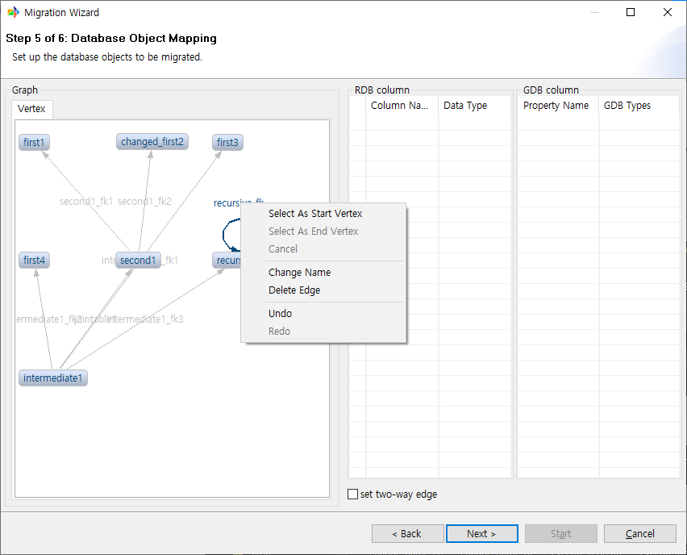

2. Select [Delete Edge] to delete the selected edge.

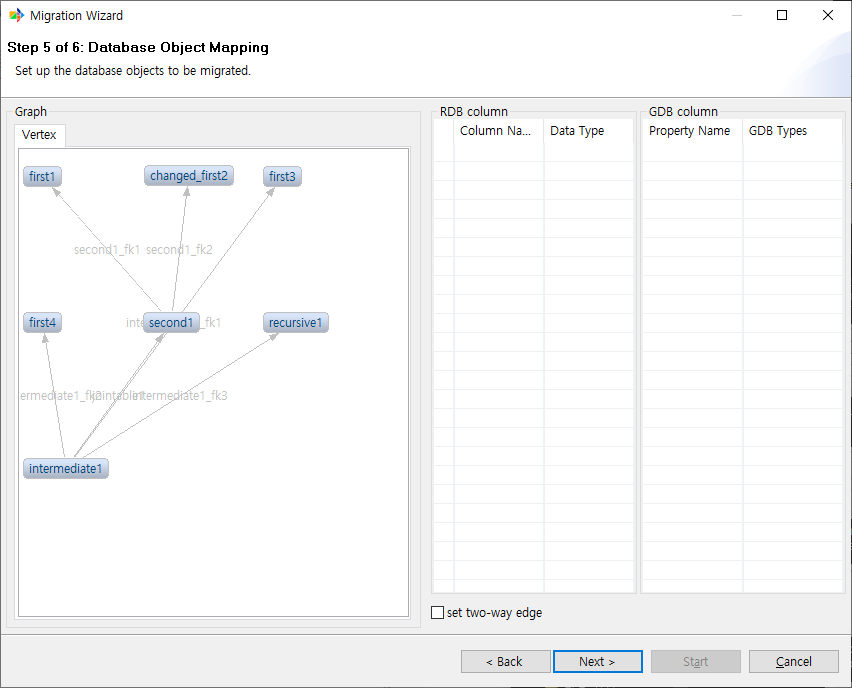

========================
Redo and Undo Feature
========================

After performing operations such as renaming objects or adding edges, you can use the redo and undo features to cancel or redo them.

The steps are as follows.

---------
undo
---------

1. After canceling a command, click anywhere and right-click.

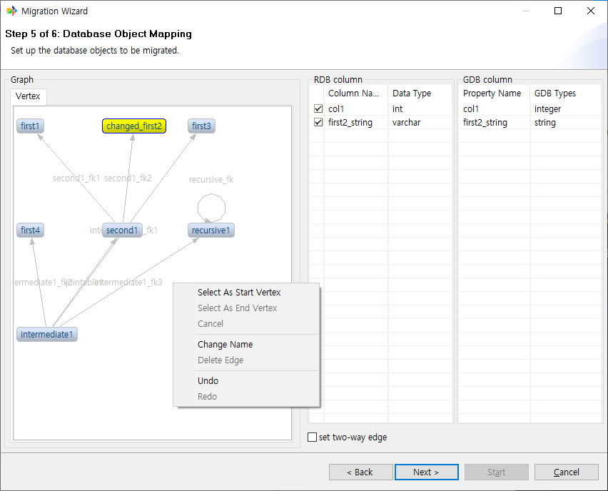

2. Click the undo button to cancel the command.

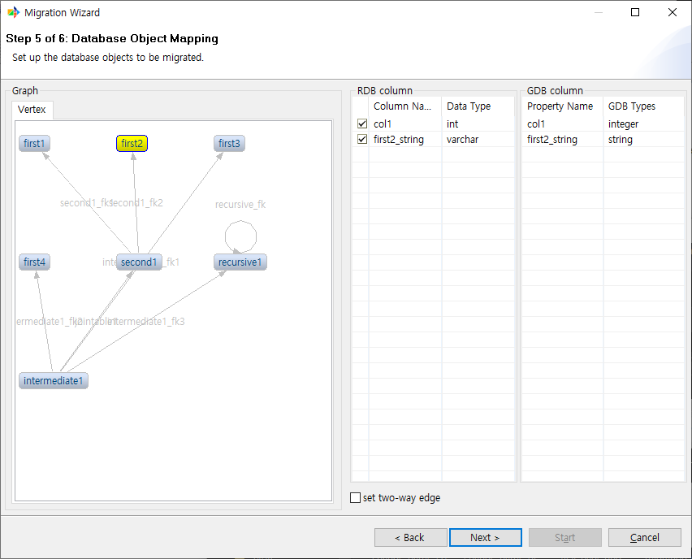

---------
redo
---------

1. After performing undo, click anywhere and right-click.

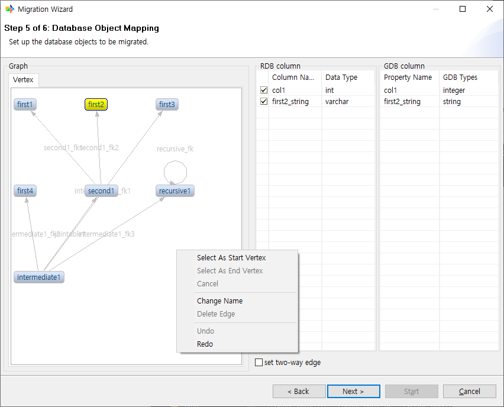

2. Click the redo button to re-execute the most recently cancelled command.

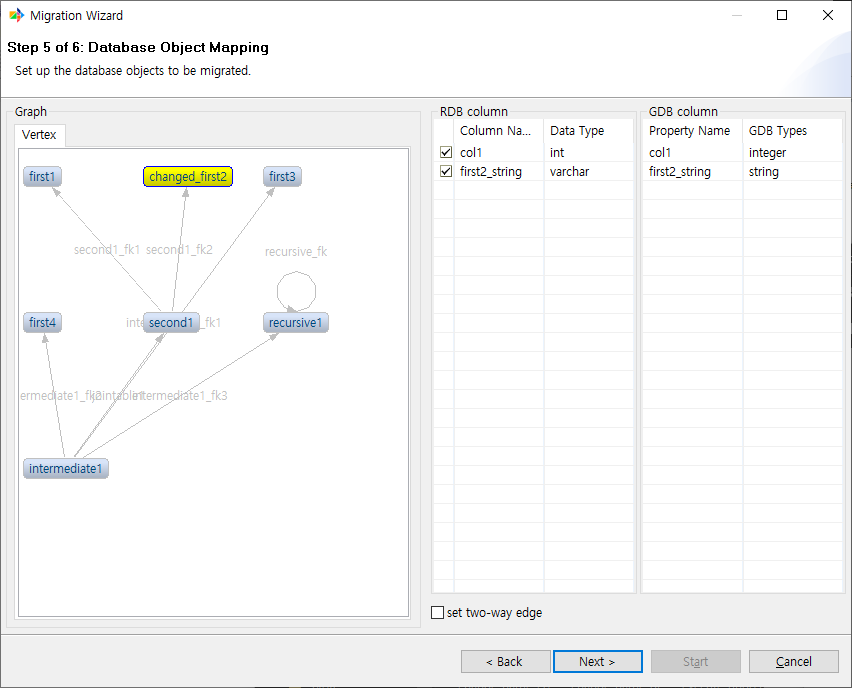

====================
two-way edge
====================

By default, all migrated edges are unidirectional. If an edge needs to be bidirectional when migrated to GDB, use this option.

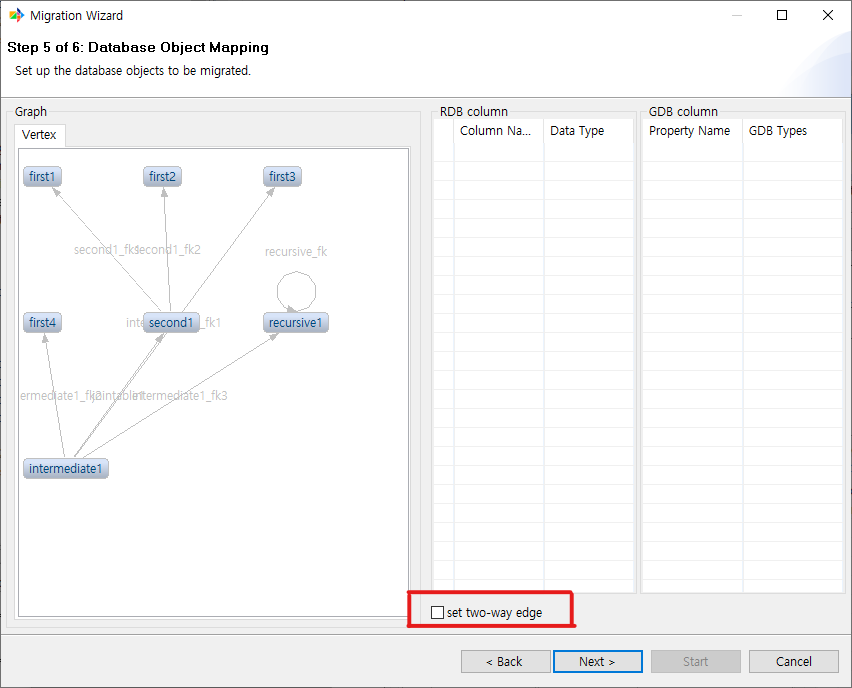
