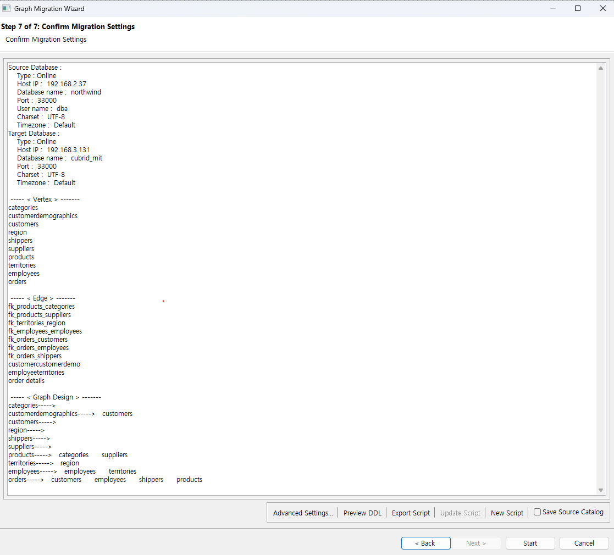
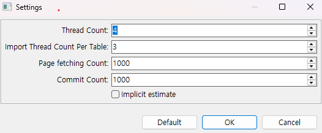
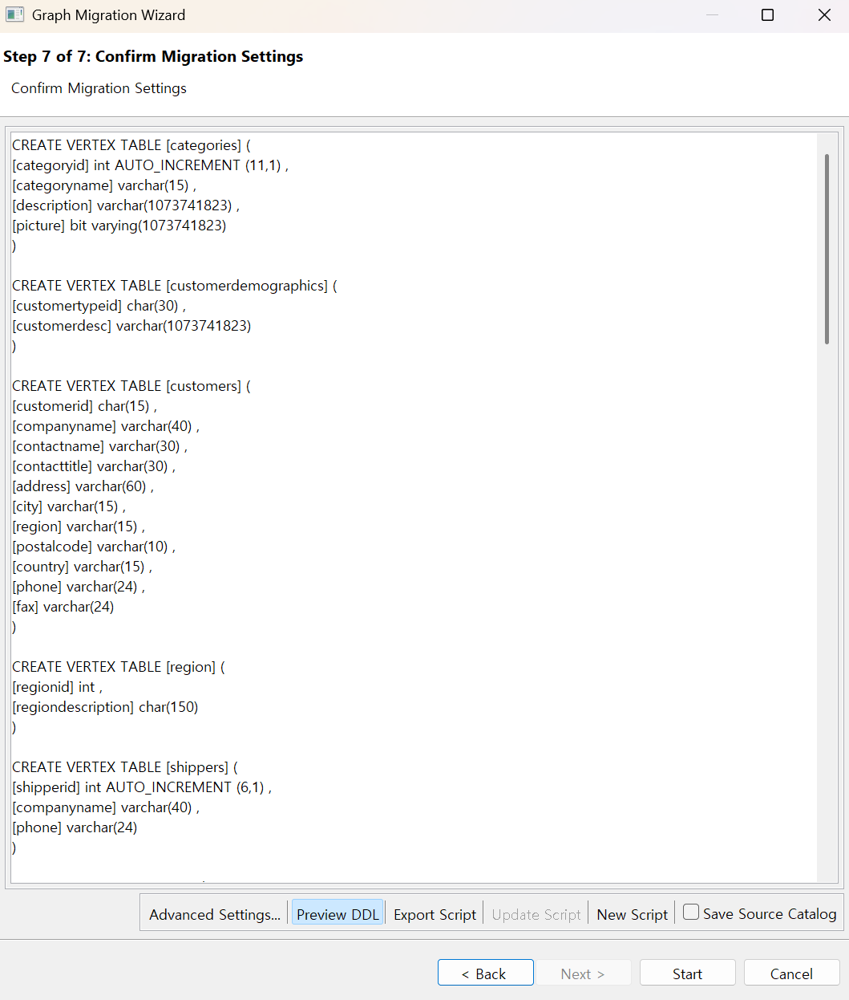

:meta-keywords: guide tool
:meta-description: Introducing the features of migration page

*************************
Migration Confirmation Page
*************************

Provides a final review of the objects to be migrated.

=====================
Source Database
=====================

Displays connection information for the source database.

=====================
Target Database
=====================

Displays connection information for the target database.

=====================
Vertex
=====================

Displays the tables to be extracted as vertices from the source DB.

=====================
Edge
=====================

Displays the join tables or foreign keys to be extracted as edges from the source DB.

=====================
Graph Design
=====================

Provides a simple text-based preview of the graph that will be created.

=====================
Advanced Settings
=====================

Allows configuration of the number of threads, commit interval, and other settings to be used during migration.

=====================
Preview DDL
=====================
You can preview the DDL that will be generated during migration.

=====================
Script
=====================

Script-related features are not available in MiT.
