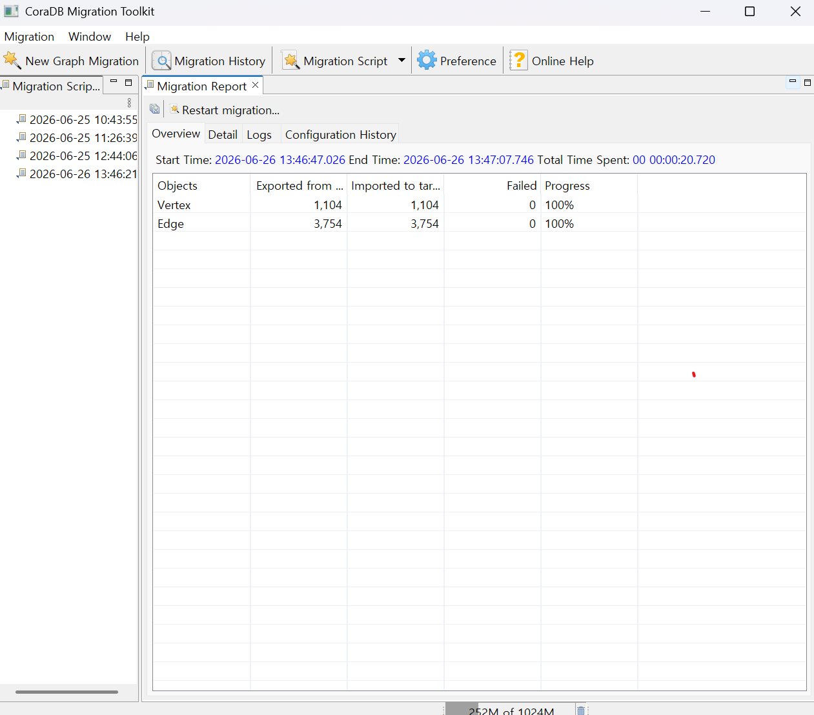
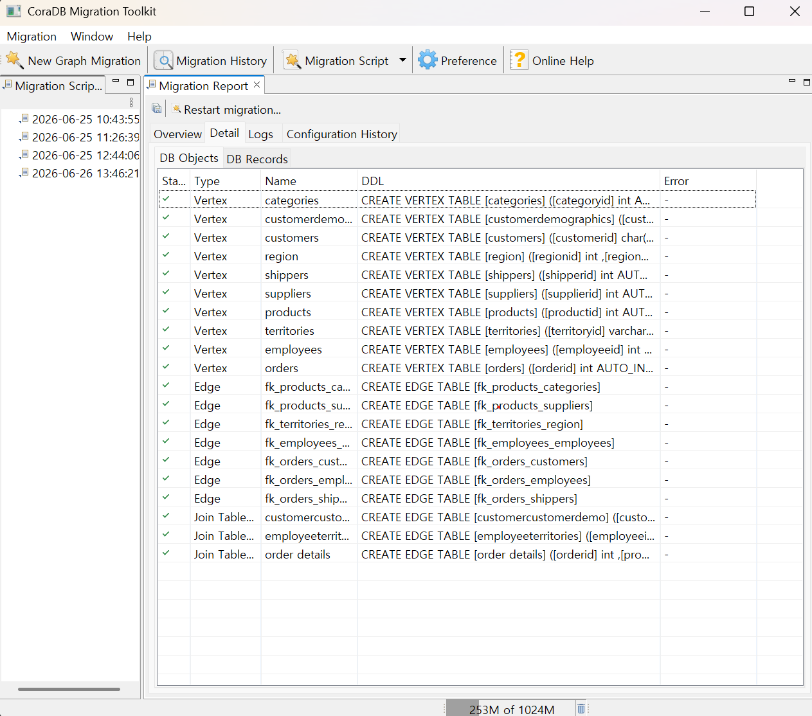
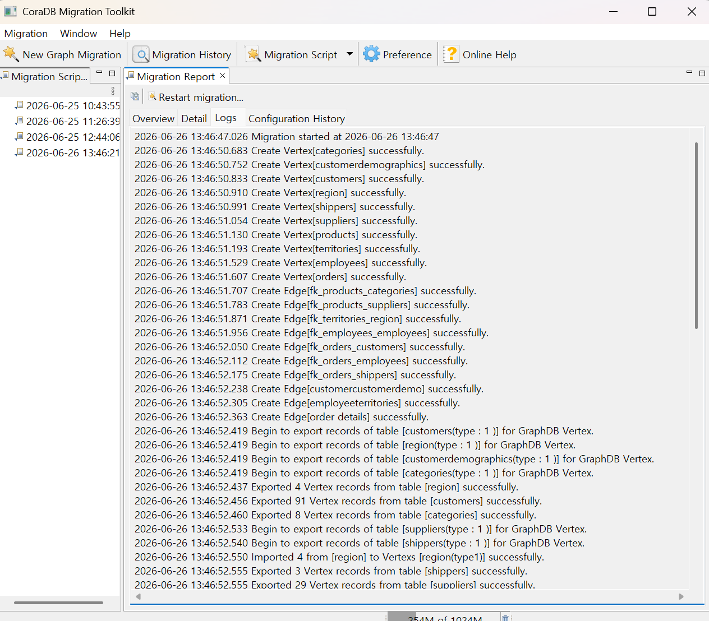
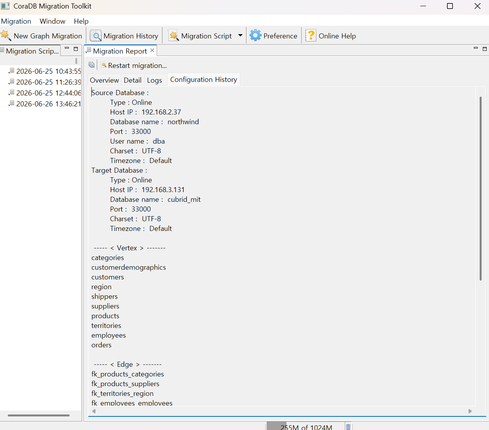

:meta-keywords: guide tool
:meta-description: Introducing the features of migration page

**********************
Migration Report
**********************

Displays the results after migration is complete.

=====
Summary
=====

You can check the number of extracted vertices and edges, the number inserted, the number failed, progress, and more.

===========
Detail Info
===========

Displays detailed information about the migration of vertices and edges.

- status: Indicates whether the migration was successful or failed.

- type: Indicates whether the migrated object is a vertex, edge, or join table edge.

- name: Displays the name of the object.

- source db object: Displays which RDB object was transformed during migration.

=====
Log
=====

Stores the content that was displayed on the console screen in the migration progress page.

===========
Settings Info
===========

Displays the information that was shown on the migration confirmation page.
