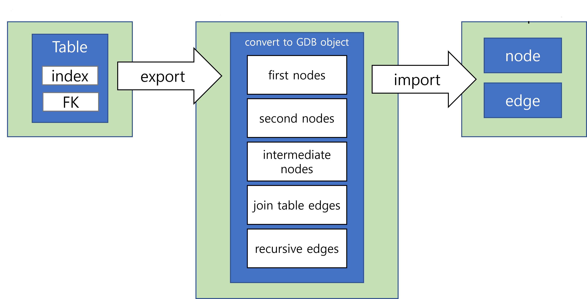

:meta-keywords: install, compatibility, run
:meta-description: supported platforms, hardware and software requirements. How to install

*******************
Program Introduction
*******************

This program is an Eclipse RCP-based tool developed to migrate DB objects, records, and other information from CUBRID, Oracle, Tibero (RDB) to CoraDB (GDB).

==============
Key Features
==============

----------------------------------------
RDB to GDB Data Migration
----------------------------------------

The main feature is to extract tables, indexes, and foreign keys from an RDB (CUBRID, Oracle, Tibero), classify them into 5 GDB object types using internal algorithms, and migrate them to GDB (CoraDB).

--------------
Data Mapping
--------------

During R2G migration, data types from RDB are converted to match the GDB format.
