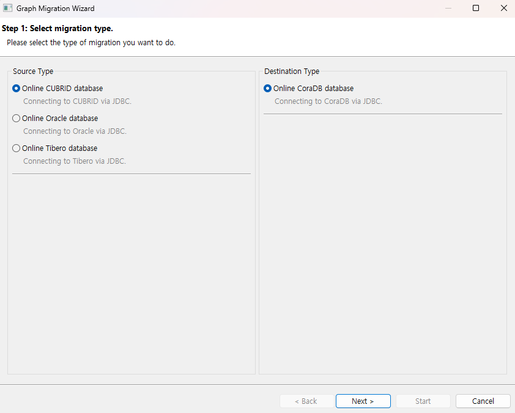
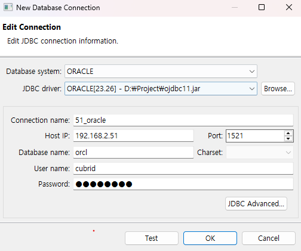
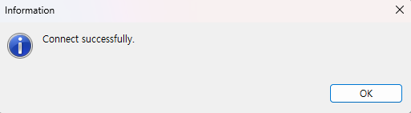

:meta-keywords: graph tools
:meta-description: Chapter contains useful information on starting Program.

***************
Getting Started
***************

This section provides a brief usage guide for first-time users of this program.

========================
Source DB Connection
========================

Describes the process for connecting to the source DB.

----------------------------
Select Migration Type
----------------------------

The screen displayed when you click the 'New Graph Migration' button to start a migration.

source type
===========

This is the left area of the screen.

This is the section where you select the source from which data will be retrieved for migration to the target.

Currently available DBMS options are CUBRID, Oracle, and Tibero.

destination type
================

This is the right area of the screen.

This is the section where you configure how the target output will be handled.

Currently, only Online CoraDB is supported.

----------------------------------------
Select Connection
----------------------------------------

Manages the connection for the source DB.

.. image:: getting_start/R2G/image/select_src_conn_page.png

You can select a pre-existing connection or create a new valid connection, then proceed to the target DB selection page or another configuration page.

Create Connection
=================

Creates a connection.

Database Type
-------------

Indicates the type of the currently selected database. The available source DBs are CUBRID, Oracle, and Tibero.

Select JDBC Driver
------------------

Click Browse to add a JDBC driver. If you have done this before, you can reuse a previously used JDBC driver via the dropdown menu.
The CUBRID JDBC driver is pre-added. Oracle and Tibero drivers must be downloaded and added manually.
For Oracle, if an orai18n.jar-related error occurs depending on the ojdbc version, download it to the same path as the selected JDBC driver, copy it to the same folder, then restart the program and reconnect to resolve the error.

Connection Name
---------------

Enter a name to be displayed on the source DB selection page.

Host Address
------------

Enter the IP address where the source DB is located.

Connection Port
---------------

Enter the port number of the DB. The default value is 33000, which is the default port for CUBRID. (Oracle: 1521, Tibero: 8629)

Database Name
-------------

Enter the schema or DB name within the source DB. (e.g., demodb for CUBRID's sample DB, ORCL for Oracle)

Character Set
-------------

Set the encoding type used by the source DB. Encoding types supported by CUBRID are as follows.
Oracle and Tibero are set automatically and are not configurable.

* UTF-8 (default)
* MS949
* ISO-8859-1
* EUC-KR
* EUC-JR
* GB2312
* GBK

Username
--------

Enter the account name to connect to the DB.

Password
--------

Enter the account password.

JDBC Advanced Settings
----------------------

Allows customization of the JDBC URL. If a parameter is required when connecting to the DB, it can be configured here.

.. image:: getting_start/R2G/image/select_src_custom_url.png

Test
====

Tests the connection using the entered information.

=================
RDB to GDB
=================

Refer to the following for details on each migration feature.

.. toctree::
    :titlesonly:
    :maxdepth: 1

    getting_start/0.RDB_to_GDB.rst
    getting_start/5.Type_Mapping.rst
