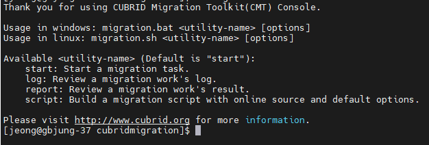

:meta-keywords: install, compatibility, run 
:meta-description: supported platforms, hardware and software requirements. How to install

*************
프로그램 소개
*************

본 프로그램은 CUBRID, Oracle, Tibero (RDB)에서 CoraDB (GDB)로 DB object, record 등의 정보를 마이그레이션 할 수 있도록 개발된 Eclipse RCP 기반의 도구이다.

==============
주요 기능
==============

----------------------------
RDB to GDB 데이터 마이그레이션
----------------------------

.. image:: image/MiT_structure.png

주요 기능은 RDB(CUBRID, Oracle, Tibero)에서 table, index, fk를 추출하여 MiT 내부에서 알고리즘에 따라 총 5가지 GDB 오브젝트로 분류 후 GDB(CoraDB)로 마이그레이션하는 기능이다.

------------------------------
RDB to File 데이터 이관
------------------------------

RDB에 있는 table schema와 record를 GQL 쿼리 형식으로 출력하거나 GDB에 로드 가능한 csv 형식으로 출력하는 기능을 지원한다.

--------------
데이터 맵핑
--------------

R2G 마이그레이션 시 RDB의 데이터 타입을 GDB에 맞게 변환한다.

-----------------
CLI 마이그레이션
-----------------

이관 후 출력된 script 파일을 기반으로 CLI 환경에서 마이그레이션이 가능하다.