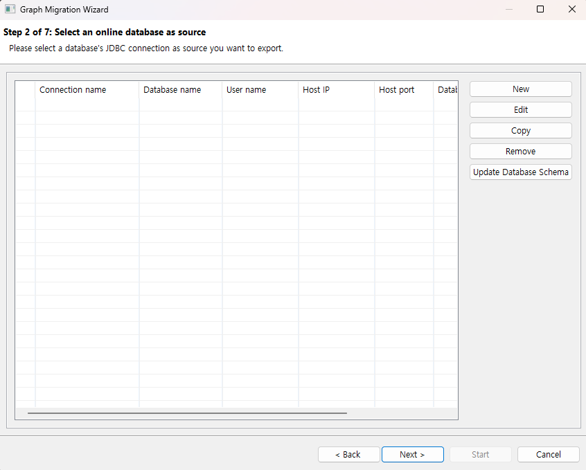
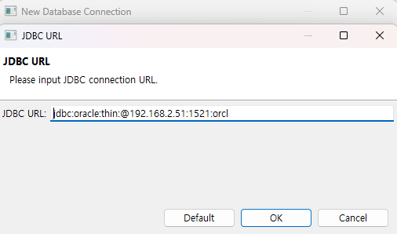

:meta-keywords: graph tools
:meta-description: Chapter contains useful information on starting Program.

********
시작하기
********

본 프로그램을 처음 사용하는데 참고할 수 있는 간략한 사용법을 설명한다. 

========================
원본 DB 연결 관련
========================

원본 DB에 연결 하기 위한 과정을 소개한다.

----------------------------
이관 타입 선택
----------------------------

.. image:: image/GDB_to_RDB2.png

이관을 실행하기 위해 '새 그래프 마이그레이션' 버튼을 선택하면 표시되는 화면.

source type
================

화면의 왼쪽 영역에 해당하는 부분이다.

target으로 이관할 데이터를 가져올 source를 선택하는 부분이다.

현재 선택 가능한 DBMS는 CUBRID, Oracle, Tibero가 있다.

destination type
================

화면의 오른쪽 영역에 해당하는 부분이다.

target의 출력을 어떻게 할 것인지 설정하는 부분이다.

현재는 Onlne CoraDB만 지원한다.

----------------------------------------
연결 선택
----------------------------------------

원본DB의 connection을 관리한다.

미리 생성된 연결을 선택하거나 유효한 연결을 새로 생성하여 선택한 뒤 대상DB 선택 페이지 또는 다른 설정 페이지로 진행할 수 있다.

연결 생성
=============

connection을 생성한다

.. image:: getting_start/R2G/image/select_src_conn_page_create_conn.png

데이터베이스 종류
------------------

현재 선택된 데이터베이스의 타입을 나타낸다. 현재 원본 DB는 CUBRID, Oracle, Tibero가 있다.

JDBC 드라이버 선택
---------------------

찾아보기를 눌러 JDBC 드라이버를 추가할 수 있다. 만약 한번 진행 했을 경우 dropbox 메뉴를 통해 기존에 사용했던 JDBC를 사용할 수 있다.
CUBRID JDBC는 미리 추가 되어 있으며 Oracle, Tibero는 다운로드 후 추가하여 사용하여야 한다.
Oracle에 경우 연결시 ojdbc버전에 따라 orai18n.jar 관련 오류가 발생하는 경우 선택 된 jdbc와 동일한 경로에 다운로드 후 동일한 폴더에 복사 후 
프로그램을 재시작하여 다시 연결하면 오류를 해결 할 수 있다.

연결 이름
------------------------

원본 DB 선택 페이지에서 보여질 이름을 입력할 수 있다.

호스트 주소
------------------------

원본 DB가 있는 IP주소를 입력한다.

연결 포트
------------------------

DB의 포트 번호를 입력한다. 기본값은 CUBRID의 기본 포트인 33000으로 되어있다. (Oracle의 경우 1521, Tibero의 경우 8629)

데이터베이스 이름
------------------------

원본 DB 내부의 스키마 또는 DB 이름을 입력한다. (e.g. CUBRID의 샘플 DB인 demodb, Orcale에 경우 ORCL)

문자 집합
------------------------

원본 DB에서 사용중인 인코딩 타입을 설정한다. CUBRID가 지원하는 인코딩 타입은 아래와 같다.
Oracle, Tibero에 경우 자동 설정되므로 지원하지 않는다.

* UTF-8(기본)
* MS949
* ISO-8859-1
* EUC-KR
* EUC-JR
* GB2312
* GBK

사용자 이름
-------------------------

DB에 접속하기 위한 계정 이름을 입력한다.

비밀번호
-------------------------

계정의 비밀번호를 입력한다.

JDBC 고급 설정
-------------------------

JDBC URL을 커스텀 할 수 있다. 만약 DB연결시 parameter가 필요할 경우 해당 옵션에서 사용할 수 있다.

테스트
========================

입력된 정보를 통해 연결을 테스트한다. 

.. image:: getting_start/R2G/image/select_conn_test.png

=================
RDB to GDB
=================

각 이관 기능 별 세부 사항은 다음을 참고한다.

.. toctree::
    :titlesonly:
    :maxdepth: 1

    getting_start/0.RDB_to_GDB.rst
    getting_start/5.Type_Mapping.rst
